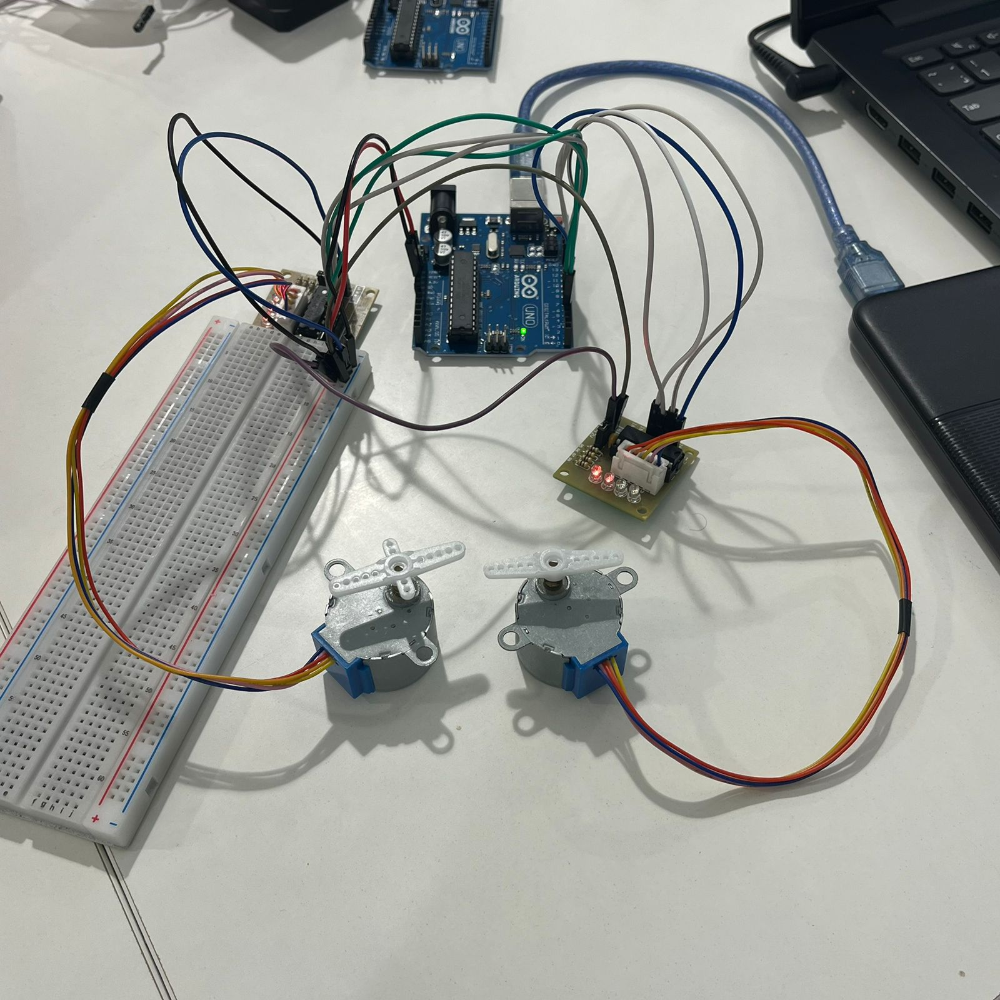

# Arduino Dual Stepper Motor Speed Control

## Overview
This project demonstrates controlling **two stepper motors** using an **Arduino Uno**.

Each motor rotates at a **different speed**, allowing comparison between slow and fast motion.



---

## Components
- Arduino Uno
- 2x Stepper Motor (28BYJ-48)
- 2x ULN2003 Driver Modules
- Jumper Wires
- Breadboard
- USB Cable or External Power

---

## Wiring

### Motor 1 (Slow)
- IN1 → Pin 8
- IN2 → Pin 9
- IN3 → Pin 10
- IN4 → Pin 11

### Motor 2 (Fast)
- IN1 → Pin 4
- IN2 → Pin 5
- IN3 → Pin 6
- IN4 → Pin 7

### Power
- VCC → 5V
- GND → GND

> For better performance, use external 5V supply if motors are unstable

---

## How It Works
- Each motor has its own control pins
- Each motor has different speed settings
- Both motors run at the same time

---

## Code
```cpp
#include <Stepper.h>

const int stepsPerRevolution = 2048;

// Motor 1 (slow)
Stepper motor1(stepsPerRevolution, 8, 10, 9, 11);

// Motor 2 (fast)
Stepper motor2(stepsPerRevolution, 4, 6, 5, 7);

void setup() {
  motor1.setSpeed(5);   // Slow
  motor2.setSpeed(15);  // Fast
}

void loop() {
  motor1.step(100);
  motor2.step(100);
}
